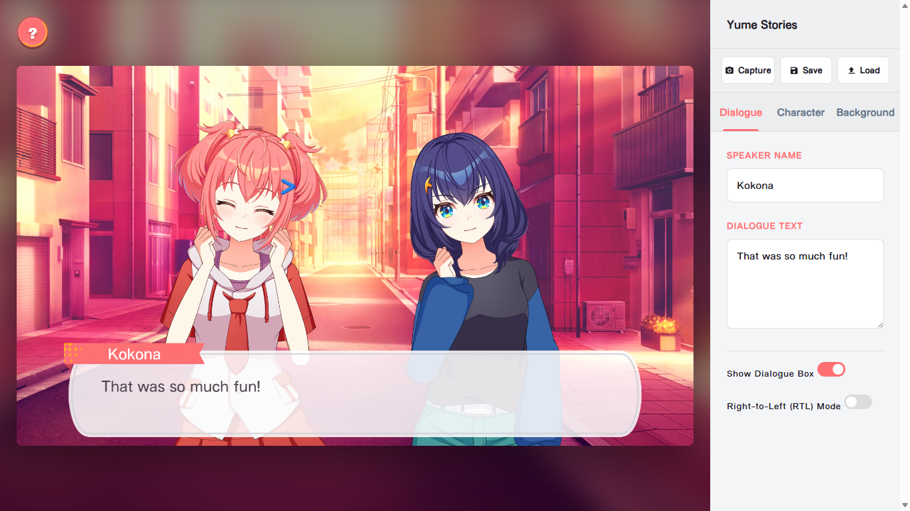

<div align="center">
  
  <hr>
</div>

<div align="center">
  
  
  
  
</div>

## About
A self-made adventure Maker to create your own stories for game [ワールドダイスター 夢のステラリウム](https://world-dai-star.com/game).

Thanks to [Cpk0521](https://github.com/Cpk0521) for making the original [WDS_Adv_Player](https://github.com/Cpk0521/WDS_Adv_Player) base!

## Demo
[Online Demo](https://yume-stories.pages.dev/)

## URL Parameters

| Parameters  | description | value |
| :-------------: | :-------------: | :-------------:|
|renderer  | Renderer Type | `webgl`, `webgpu` |

Example : 
 - `https://yume-stories.pages.dev/?renderer=webgl`

## Quick Start

```shell
# Install dependencies
yarn install

# Start development server
yarn run dev

# Build for production
yarn run build
```